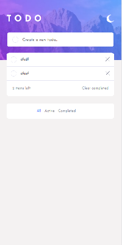

# Frontend Mentor - Todo app solution

This is a solution to the [Todo app challenge on Frontend Mentor](https://www.frontendmentor.io/challenges/todo-app-Su1_KokOW). Frontend Mentor challenges help you improve your coding skills by building realistic projects. 

## Table of contents

- [Overview](#overview)
  - [The challenge](#the-challenge)
  - [Screenshot](#screenshot)
- [My process](#my-process)
  - [Built with](#built-with)
  - [What I learned](#what-i-learned)
  - [Useful resources](#useful-resources)
- [Author](#author)

## Overview

### The challenge

Users should be able to:

- View the optimal layout for the app depending on their device's screen size
- See hover states for all interactive elements on the page
- Add new todos to the list
- Mark todos as complete
- Delete todos from the list
- Filter by all/active/complete todos
- Clear all completed todos
- Toggle light and dark mode

### Screenshot

## My process

### Built with

- Semantic HTML5 markup
- CSS custom properties
- Flexbox
- CSS Grid
- Mobile-first workflow
- SASS templates
- Vite
- [Vue 3](https://v3.vuejs.org/) - JS library

### What I learned

1. Concepts such as how Vue.js works in the real would with reusable items like components, plugins, mixins and so on.
2. Vue 3 - Composition API and how works the reactive elements.
3. Grid box and flex box, which scenarios should be use each one.
4. SASS and BEM methodology. 

### Useful resources

- [Vue 3 - Script setup](https://v3.vuejs.org/api/sfc-script-setup.html) - Using composition API with script setup.
- [Vue 3 - Script setup](https://v3.vuejs.org/api/composition-api.html#setup) - Using composition API with script setup.
- [Composition API](https://css-tricks.com/snippets/css/a-guide-to-flexbox/) - Guide to understand the composition API and how design reusable and maintainable components in Vue 3.
- [CSS Grid box guide](https://css-tricks.com/snippets/css/complete-guide-grid/) - Our comprehensive guide to CSS grid, focusing on all the settings both for the grid parent container and the grid child elements.

**Note: Delete this note and replace the list above with resources that helped you during the challenge. These could come in handy for anyone viewing your solution or for yourself when you look back on this project in the future.**

## Author

- Website - [Nicolas Montoya](https://www.nicolasmontoya.com)
- Frontend Mentor - [@NicolasMontoya](https://www.frontendmentor.io/profile/NicolasMontoya)

